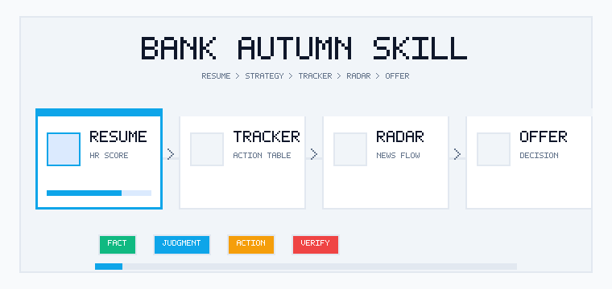
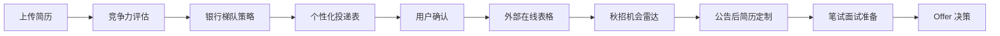

<div align="center">

# 银行秋招 Skill

**不是模板化 AI 简历打分，而是一套围绕银行秋招的保姆级陪跑系统。**

帮你判断方向、生成投递表、盯住机会动态，并一路推进到笔面试和 Offer 决策。

<p>
  <a href="https://agentskills.io/"></a>
  
  
</p>

<p>
  
</p>

</div>

投银行秋招最难的地方，往往不是“没有信息”，而是信息太碎、节奏太乱、判断太依赖经验：

- 简历到底适合政策行、六大行、股份行，还是城商行/农商行？
- 哪些银行值得主攻，哪些只是冲刺或观察？
- 公告、网申、笔试、面试、体检、签约，每一步该什么时候处理？
- 小红书、牛客、社群截图里的信息，哪些能参考，哪些必须核验？
- 拿到意向或 Offer 后，稳定性、成长性、薪酬、城市和岗位真相怎么权衡？

`bank-autumn-recruitment` 把职业咨询老师的判断流程、银行 HR 的筛选视角、上岸同学复盘和公开优质经验帖，沉淀成一个可复用的 Agent Skill。它不只给你一个分数，而是把银行秋招拆成能判断、能执行、能跟进、能复盘的流程。

## 为什么不是又一个 AI 打分工具

很多工具停在“上传简历 -> 得到匹配度”。这个 Skill 更往后走一步：

| 普通 AI 简历评分 | 银行秋招 Skill |
|---|---|
| 给一个笼统分数 | 给证据、短板、风险和下一步动作 |
| 所有银行用一套标准 | 区分政策行、六大行、股份行、城商行/农商行 |
| 推荐岗位后就结束 | 生成投递表，并持续围绕表格做动态跟进 |
| 信息源混在一起 | 区分官方事实、经验判断、弱线索和待验证项 |
| 只关注投递前 | 覆盖网申、笔试、面试、体检、签约和 Offer 决策 |

一句话：

```text
它不是替你“算命式评估适配度”，而是把真实招聘判断和求职经验，转成一套能跟着走的银行秋招执行系统。
```

## 核心亮点

### 1. 银行 HR 视角的简历竞争力评估

按银行秋招常见筛选逻辑拆解简历，而不是泛泛说“建议突出实习经历”。

| 维度 | 权重 |
|---|---:|
| 学历背景 | 25% |
| 金融/银行相关实习经历 | 25% |
| 专业对口度 | 15% |
| 证书 | 15% |
| 项目经历 | 10% |
| 校园经历 | 10% |

输出会明确写出：简历证据、加权评分、主要短板、可补强方向，以及不同银行类型下的风险点。

### 2. 不把所有银行混成一套打法

银行秋招不是简单海投。Skill 会按银行类型拆策略：

- 政策性银行：更看重学历背景、稳定动机、组织适配和长期发展意愿。
- 国有六大行：更关注区域、岗位方向、分支机构层级和综合素质。
- 股份制银行：更看重实习、业务理解、项目深挖和抗压能力。
- 城商行/农商行：更需要结合城市偏好、家庭支持、稳定性和本地资源判断。

最终会把机会拆成主攻、重点、冲刺、观察，而不是给一串看起来很全但无法执行的银行名单。

### 3. 个性化投递表，不是静态信息表

投递表是秋招执行工作台。它会记录：

```text
银行名称 | 银行类型 | 同类梯队 | 投递优先级 | 推荐岗位方向 | 投递批次 |
开始时间 | 截止时间 | 投递日期 | 官方招聘网站 | 网申入口 | 公告链接 |
简历版本 | 投递状态 | 笔试 | 一面 | 二面 | 三面/终面 |
推荐理由 | 主要风险 | 下一动作 | 提醒日期 | 备注
```

生成逻辑坚持三件事：

- 银行库负责可核验事实。
- 咨询判断负责筛选和取舍。
- 投递表负责执行、提醒和复盘。

### 4. 秋招机会雷达：投完之后继续帮你盯

外部投递表创建后，不是“表格做好就结束”。机会雷达会围绕用户确认过的投递表，持续提醒真正影响下一步行动的信息。

| 入口 | 作用 |
|---|---|
| 今日待办 | 盯截止 7/3/1 天内的岗位，提醒准备材料、完成网申或明确放弃 |
| 公告更新 | 关注目标银行官网、校招专题页、官方公众号、学校就业网等官方来源 |
| 流程动态 | 对已投递、测评、笔试、面试中的岗位，提示同批次通知和流程线索 |
| 周度复盘 | 汇总新增机会、推进阶段、卡点岗位和下一周策略 |

重点不是每天扫全网推一堆信息，而是围绕你的投递进度，只提醒有动作价值的变化。

### 5. 官方事实和社区线索分开呈现

Skill 不把二手信息当结论。

- 可靠事实：银行官网、官方招聘页、校招专题、学校就业网、企业正式通知。
- 弱线索：牛客、小红书、社群截图、匿名流程帖、经验贴评论。
- 待验证项：无法确认的截止时间、薪资、HC、笔试批次、开放状态。

这能避免一个常见问题：看了很多经验贴，但最后不知道哪些是真的、哪些只适合别人。

### 6. 一路陪到笔面试和 Offer 决策

公告出来后，Skill 不会直接“润色整份简历”，而是先判断岗位是否值得投，再选择最匹配的经历证据，生成岗位版简历策略和网申细节。

进入笔面试阶段后，它会覆盖：

- EPI/行测
- 英语
- 金融经济
- 银行特色知识
- 无领导小组讨论
- 半结构化面试
- 结构化面试

拿到意向或 Offer 后，会用银行 Offer 的“不可能三角”做决策：

| 维度 | 关注点 |
|---|---|
| 稳定性 | 银行类型、合同主体、机构层级、轮岗定岗、试用期 |
| 成长性 | 岗位内容、培训、晋升、是否能积累可迁移能力 |
| 回报与生活成本 | 固定薪资、绩效、年终、公积金、城市成本、通勤和家庭支持 |

信息不足时，它会先追问合同主体、机构层级、岗位真相、薪酬拆解、KPI 和签约约束，而不是强行排序。

## 适合谁

- 2027 届准备投银行秋招/校招，但不知道从哪里开始的同学。
- 想投银行，但分不清政策行、六大行、股份行、本地银行打法差异的同学。
- 简历里有实习、项目、证书，却不知道怎么转成银行网申语言的同学。
- 已经开始投递，但被公告、截止、笔试通知、面试安排打乱节奏的同学。
- 不想盲目海投，希望有人帮自己拆主攻、重点、冲刺和观察机会的同学。
- 已经拿到意向或 Offer，需要比较稳定性、成长性、薪酬、城市和岗位真实内容的同学。

## 你会得到什么

| 阶段 | 典型产出 |
|---|---|
| 简历上传后 | 银行秋招竞争力评分、证据链、短板诊断、补强建议 |
| 确定方向时 | 政策行/六大行/股份行/城商农商行投递策略 |
| 开始投递前 | 个性化 Markdown 投递表预览 |
| 用户确认后 | Notion、腾讯文档、飞书表格、Google Sheets 或 Excel 追踪表 |
| 投递过程中 | 今日待办、公告更新、流程动态、周度复盘 |
| 公告或 JD 出来后 | 岗位选择、岗位版简历策略、网申细节提醒 |
| 笔面试阶段 | 笔试模块拆解、面试题型准备、复盘建议 |
| Offer 阶段 | 银行 Offer 不可能三角、风险核验清单、决策矩阵 |

## 工作流



## 快速开始

### 1. 克隆仓库

```bash
git clone https://github.com/wljsxmmxmm/bank-autumn-recruitment-skill.git
cd bank-autumn-recruitment-skill
```

### 2. 在支持 Agent Skills 的环境中使用

把 Skill 目录放到你的 Agent 可读取的 Skills 目录中，或直接在当前仓库中打开支持 Agent Skills 的工具。

核心目录：

```text
.agents/skills/bank-autumn-recruitment
```

如果你想复制到本机全局 Skills 目录，可以按你的工具选择目标目录，例如：

```bash
cp -r .agents/skills/bank-autumn-recruitment ~/.codex/skills/
```

或：

```bash
cp -r .agents/skills/bank-autumn-recruitment ~/.claude/skills/
```

### 3. 用自然语言触发

可以直接对 Codex、Claude Code 或其他支持 Skills 的 Agent 说：

```text
我是 2027 届，想投银行秋招，先帮我做一个从简历到 Offer 的陪跑计划。
```

或：

```text
我上传了简历，帮我评估银行秋招竞争力，并生成投递梯队和追踪表预览。
```

## 使用示例

### 从零开始规划

```text
我现在大三/研二，想准备 2027 届银行秋招，但不知道适合投哪些银行。
请先根据我的背景判断方向，再给我一套投递策略。
```

### 简历竞争力评估

```text
这是我的简历。请按银行 HR 视角评估我的秋招竞争力，
指出适合主攻的银行类型、主要短板和接下来 2-4 周最该补什么。
```

### 生成投递表

```text
请基于我的城市偏好、岗位方向和风险偏好，
生成银行秋招 Markdown 投递表预览。确认后再帮我转成在线表格。
```

### 公告后定制

```text
这个银行公告出来了。请先判断我适不适合投，
再帮我选择岗位、调整简历重点，并提醒网申里容易踩坑的地方。
```

### Offer 决策

```text
我拿到了两个银行 Offer。请用稳定性、成长性、回报与生活成本帮我做决策，
同时列出合同主体、岗位真实内容、薪酬拆解和签约约束里需要核验的问题。
```

## 仓库结构

```text
.agents/
└── skills/
    └── bank-autumn-recruitment/
        ├── SKILL.md
        ├── agents/
        │   └── openai.yaml
        ├── assets/
        │   ├── bank-autumn-workflow-sample.md
        │   └── personalized-bank-tracking-sample.md
        ├── evals/
        │   ├── quality-cases.md
        │   └── routing-cases.md
        ├── references/
        │   ├── resume-competitiveness.md
        │   ├── bank-tier-strategy.md
        │   ├── personalized-bank-tracking-template.md
        │   ├── application-tracker.md
        │   ├── bank-recruitment-library-template.md
        │   ├── automation-playbook.md
        │   ├── external-doc-conversion-rules.md
        │   ├── announcement-resume-tailoring.md
        │   ├── exam-interview-guidance.md
        │   └── offer-decision-framework.md
        └── scripts/
            ├── generate_tracking_table.py
            └── test_generate_tracking_table.py
```

## 质量验证

追踪表生成逻辑由脚本负责，避免 Agent 手写排序表导致字段混乱。

```bash
python3 .agents/skills/bank-autumn-recruitment/scripts/test_generate_tracking_table.py
```

如果你本地有 Skill 校验工具，也可以继续运行：

```bash
python3 /path/to/skill-creator/scripts/quick_validate.py .agents/skills/bank-autumn-recruitment
```

## 诚实边界

这个 Skill 会尽量帮你把银行秋招变得清楚、可执行、可复盘，但它不会做这些事：

- 不替用户自动投递。
- 不承诺录用或“上岸”。
- 不承诺覆盖全部银行、全部岗位或全部批次。
- 不编造当年公告、截止日期、薪资、HC、笔试时间或岗位开放状态。
- 不把小红书、牛客、社群截图、匿名爆料当作官方事实。
- 不在信息不足时强行给 Offer 排序。
- 涉及合同、三方、违约金、户口和法律风险时，只做风险清单和核验问题，不给法律结论。

## Roadmap

- 补全更多主流银行官方招聘入口和年度公告样例。
- 增强“秋招机会雷达”的今日待办、公告更新、流程动态和周度复盘模板。
- 增加更多外部表格平台的字段映射和提醒规则。
- 建立银行岗位 JD 关键词与简历证据的可复用映射库。
- 将真实咨询案例脱敏后沉淀为判断样本，让策略更贴近学生的实际处境。
