<div align="center">

# 秋招 Skills —— 银行篇

**不是模板化 AI 简历打分，而是一套围绕银行秋招的保姆级陪跑系统。**

帮你判断方向、生成投递表、盯住机会动态，并一路推进到笔面试和 Offer 决策。

<p>
  <a href="https://agentskills.io/"></a>
  <a href="LICENSE"></a>
  
  
  
  
  
</p>

<p>
  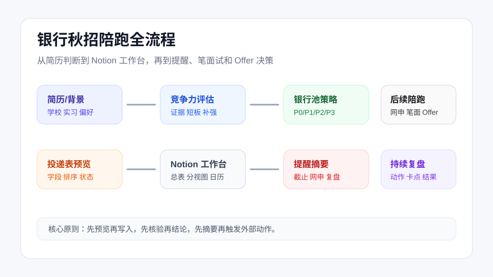
</p>

</div>

投银行秋招最难的地方，往往不是“没有信息”，而是信息太碎、节奏太乱、判断太依赖经验：

- 简历到底适合政策行、六大行、股份行，还是城商行/农商行？
- 哪些银行值得主攻，哪些只是冲刺或观察？
- 公告、网申、笔试、面试、体检、签约，每一步该什么时候处理？
- 小红书、牛客、社群截图里的信息，哪些能参考，哪些必须核验？
- 拿到意向或 Offer 后，稳定性、成长性、薪酬、城市和岗位真相怎么权衡？

`bank-autumn-recruitment` 把职业咨询老师的判断流程、银行 HR 的筛选视角、上岸同学复盘和公开优质经验帖，沉淀成一个可复用的 Agent Skill。它不只给你一个分数，而是把银行秋招拆成能判断、能执行、能跟进、能复盘的流程。

## 为什么不是又一个 AI 打分工具

很多工具停在“上传简历 -> 得到匹配度”。这个 Skill 更往后走一步：

| 普通 AI 简历评分 | 银行秋招 Skill |
|---|---|
| 给一个笼统分数 | 给证据、短板、风险和下一步动作 |
| 所有银行用一套标准 | 区分政策行、六大行、股份行、城商行/农商行 |
| 推荐岗位后就结束 | 生成投递表，并持续围绕表格做动态跟进 |
| 信息源混在一起 | 区分官方事实、经验判断、弱线索和待验证项 |
| 只关注投递前 | 覆盖网申、笔试、面试、体检、签约和 Offer 决策 |

一句话：

```text
它不是替你“算命式评估适配度”，而是把真实招聘判断和求职经验，
转成一套能跟着走的银行秋招执行系统。
```

## 核心亮点

### 1. 银行 HR 视角的简历竞争力评估

按银行秋招常见筛选逻辑拆解简历，而不是泛泛说“建议突出实习经历”。

| 维度 | 权重 |
|---|---:|
| 学历背景 | 25% |
| 金融/银行相关实习经历 | 25% |
| 专业对口度 | 15% |
| 证书 | 15% |
| 项目经历 | 10% |
| 校园经历 | 10% |

输出会明确写出：简历证据、加权评分、主要短板、可补强方向，以及不同银行类型下的风险点。

<p>
  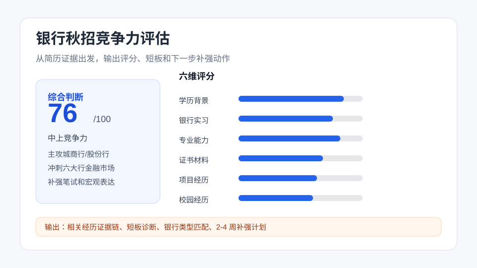
</p>

### 2. 不把所有银行混成一套打法

银行秋招不是简单海投。Skill 会按银行类型拆策略：

- 政策性银行：更看重学历背景、稳定动机、组织适配和长期发展意愿。
- 国有六大行：更关注区域、岗位方向、分支机构层级和综合素质。
- 股份制银行：更看重实习、业务理解、项目深挖和抗压能力。
- 城商行/农商行：更需要结合城市偏好、家庭支持、稳定性和本地资源判断。

最终会把机会拆成主攻、重点、冲刺、观察，而不是给一串看起来很全但无法执行的银行名单。

<p>
  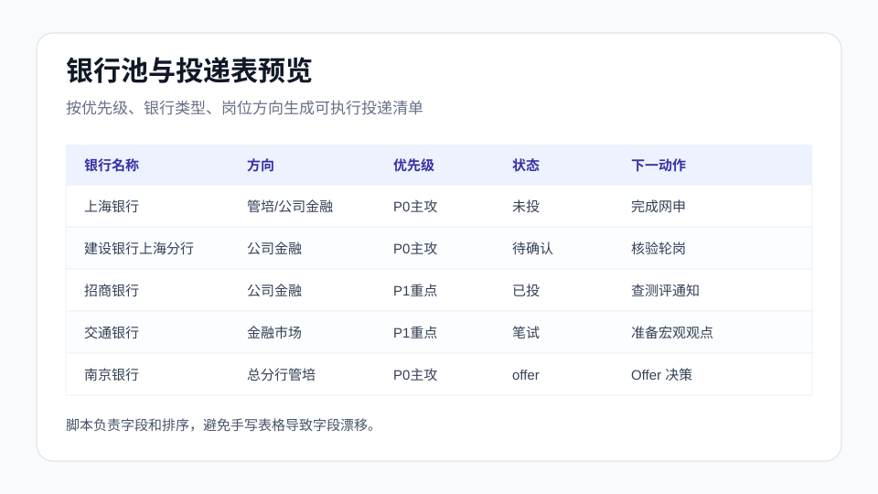
</p>

### 3. 个性化投递表，不是静态信息表

投递表是秋招执行工作台。它会记录：

```text
银行名称 | 银行类型 | 同类梯队 | 投递优先级 | 推荐岗位方向 | 投递批次 |
开始时间 | 截止时间 | 投递日期 | 官方招聘网站 | 网申入口 | 公告链接 |
简历版本 | 投递状态 | 笔试 | 一面 | 二面 | 三面/终面 |
推荐理由 | 主要风险 | 下一动作 | 提醒日期 | 备注
```

生成逻辑坚持三件事：

- 银行库负责可核验事实。
- 咨询判断负责筛选和取舍。
- 投递表负责执行、提醒和复盘。

### 4. Notion 工作台和秋招机会雷达

外部投递表创建后，不是“表格做好就结束”。机会雷达会围绕用户确认过的投递表，持续提醒真正影响下一步行动的信息。

| 入口 | 作用 |
|---|---|
| 今日待办 | 盯截止 7/3/1 天内的岗位，提醒准备材料、完成网申或明确放弃 |
| 公告更新 | 关注目标银行官网、校招专题页、官方公众号、学校就业网等官方来源 |
| 流程动态 | 对已投递、测评、笔试、面试中的岗位，提示同批次通知和流程线索 |
| 周度复盘 | 汇总新增机会、推进阶段、卡点岗位和下一周策略 |

重点不是每天扫全网推一堆信息，而是围绕你的投递进度，只提醒有动作价值的变化。

<div align="center">

> 此处预留真实 Notion 工作台截图：总表、P0 主攻、本周处理、流程中、截止日历、提醒日历、结果复盘。

</div>

<p>
  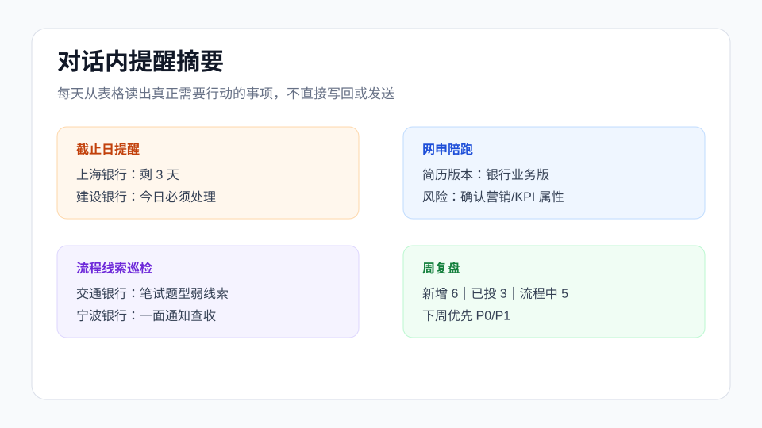
</p>

### 5. 官方事实和社区线索分开呈现

Skill 不把二手信息当结论。

- 可靠事实：银行官网、官方招聘页、校招专题、学校就业网、企业正式通知。
- 弱线索：牛客、小红书、社群截图、匿名流程帖、经验贴评论。
- 待验证项：无法确认的截止时间、薪资、HC、笔试批次、开放状态。

这能避免一个常见问题：看了很多经验贴，但最后不知道哪些是真的、哪些只适合别人。

<p>
  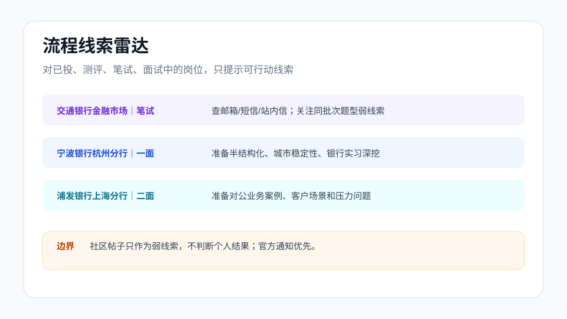
</p>

### 6. 一路陪到笔面试和 Offer 决策

公告出来后，Skill 不会直接“润色整份简历”，而是先判断岗位是否值得投，再选择最匹配的经历证据，生成岗位版简历策略和网申细节。

进入笔面试阶段后，它会覆盖：

- EPI/行测
- 英语
- 金融经济
- 银行特色知识
- 无领导小组讨论
- 半结构化面试
- 结构化面试

拿到意向或 Offer 后，Skill 不会只拿“稳定、成长、薪酬”做一个漂亮矩阵。银行 Offer 真正难判断的地方，往往藏在入职后的日常里：

| 决策层 | 会追问什么 |
|---|---|
| 岗位真相 | 是真实业务岗、轮岗池、营销压力岗，还是先进去再分配 |
| 入职体验 | 同批新人怎么分配，培训是否有效，师傅/团队风格是否稳定 |
| 生活成本 | 到手收入、房租通勤、城市消费、家庭支持和长期定居可能性 |
| 成长代价 | 能不能积累可迁移能力，还是只换来稳定但路径越来越窄 |
| 风险约束 | 合同主体、试用期、KPI、违约金、三方、户口和调岗空间 |

它会参考公开可获得的真实入职体验、流程分享和岗位反馈，把“看起来体面”的 Offer 拆到更具体的生活场景里：每天做什么、压力从哪里来、钱够不够花、几年后还能不能换路。

如果一个机会表面稳定但岗位内容不透明、营销压力高、城市成本不匹配，Skill 会直接指出风险；不会为了让用户安心而把所有 Offer 都说成“各有优势”。

<p>
  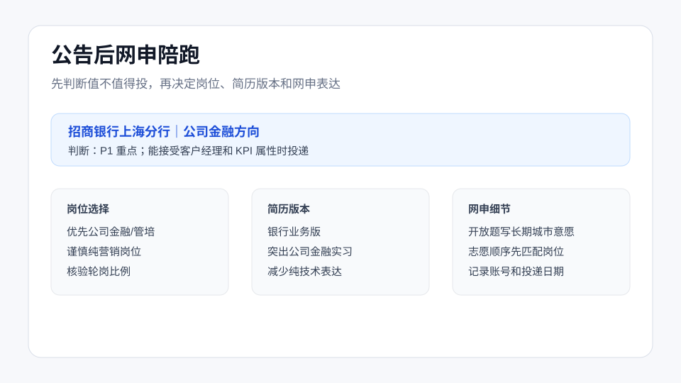
</p>

<p>
  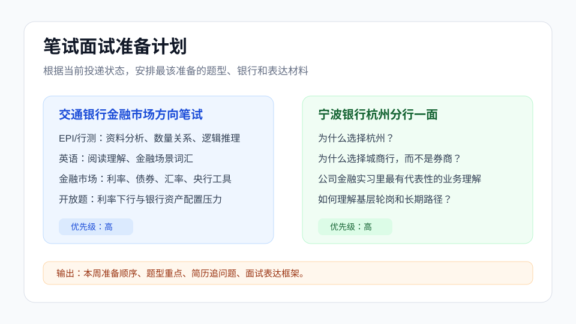
</p>

<p>
  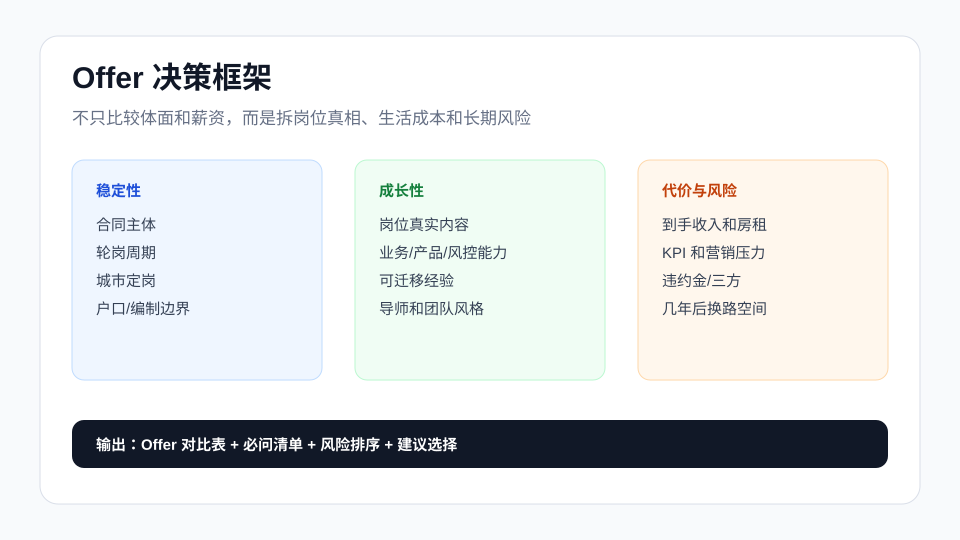
</p>

## 适合谁

- 2027 届准备投银行秋招/校招，但不知道从哪里开始的同学。
- 想投银行，但分不清政策行、六大行、股份行、本地银行打法差异的同学。
- 简历里有实习、项目、证书，却不知道怎么转成银行网申语言的同学。
- 已经开始投递，但被公告、截止、笔试通知、面试安排打乱节奏的同学。
- 不想盲目海投，希望有人帮自己拆主攻、重点、冲刺和观察机会的同学。
- 已经拿到意向或 Offer，需要比较稳定性、成长性、薪酬、城市和岗位真实内容的同学。

## 你会得到什么

| 阶段 | 典型产出 |
|---|---|
| 简历上传后 | 银行秋招竞争力评分、证据链、短板诊断、补强建议 |
| 确定方向时 | 政策行/六大行/股份行/城商农商行投递策略 |
| 开始投递前 | 个性化 Markdown 投递表预览 |
| 用户确认后 | Notion、腾讯文档、飞书表格、Google Sheets 或 Excel 追踪表 |
| 投递过程中 | 截止提醒、网申陪跑、流程线索、周度复盘 |
| 公告或 JD 出来后 | 岗位选择、岗位版简历策略、网申细节提醒 |
| 笔面试阶段 | 笔试模块拆解、面试题型准备、复盘建议 |
| Offer 阶段 | 岗位真相拆解、真实入职体验线索、生活成本暴露、风险核验清单、决策矩阵 |

## 你需要提供什么

最少可以只提供一句话：

```text
我是 2027 届，想投银行秋招，先带我做规划。
```

如果想一次跑完整流程，建议提供：

```text
1. 简历或背景自述：学校、学历、专业、实习、项目、证书、城市偏好。
2. 目标约束：是否接受柜面、营销、异地、轮岗、强 KPI。
3. 已关注岗位：银行名称、总行/分行、岗位方向、公告链接、截止时间。
4. 当前表格：Notion 链接、在线表链接，或已有投递记录。
```

完整可复制素材见：[full-workflow-case.md](.agents/skills/bank-autumn-recruitment/assets/full-workflow-case.md)。

## 功能使用说明

### 1. 入口规划

适用场景：你只有一个模糊目标，比如“我想投银行秋招”，但还没准备好简历、岗位清单或 Notion 表。

怎么用：

```text
我是 2027 届金融硕士，想投银行秋招，但还不知道适合哪些方向。先带我做规划。
```

产物：A-D 轻量菜单、信息补全清单、下一步建议。

<p>
  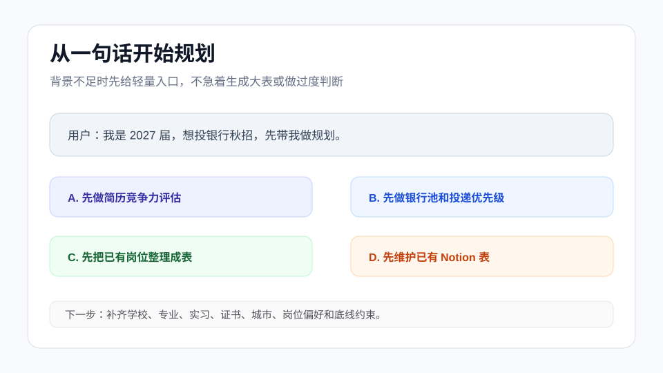
</p>

### 2. 简历竞争力评估

适用场景：你已经有简历，或能自述教育背景、实习经历、项目经历、证书和求职偏好。

怎么用：

```text
这是我的简历。请按银行 HR 视角评估我的秋招竞争力，
指出适合主攻的银行类型、主要短板和接下来 2-4 周最该补什么。
```

产物：六维评分、证据链、短板、银行类型匹配、2-4 周补强计划。

### 3. 银行池策略

适用场景：你想知道哪些银行值得主攻，哪些只是冲刺或观察。

怎么用：

```text
根据我的背景，帮我把银行秋招机会分成 P0 主攻、P1 重点、P2 冲刺、P3 观察和放弃。
```

产物：P0/P1/P2/P3/放弃分层、推荐岗位方向、主要风险和投入优先级。

### 4. 投递表预览

适用场景：你已经确认一批机会，希望先生成结构稳定的投递表，再决定是否放进 Notion。

怎么用：

```text
把这些银行岗位生成 Markdown 追踪表，先给我预览，确认后再放到 Notion。
```

产物：Markdown 投递表，覆盖银行名称、机构层级、岗位方向、优先级、公告链接、截止时间、状态、简历版本、下一动作等字段。

### 5. Notion 秋招工作台

适用场景：你确认了投递表，想把它变成可长期维护的 Notion 工作台。

怎么用：

```text
我确认这版投递表。请按银行秋招工作台结构创建 Notion，总表和分视图都要有。
```

产物：总表、P0 主攻、本周处理、流程中、截止日历、提醒日历、结果复盘等视图。

<div align="center">

> 此处预留真实 Notion 总表与分视图截图。

</div>

### 6. 对话内提醒摘要

适用场景：你已经有 Notion 或在线表，希望今天只看最该处理的事项。

怎么用：

```text
读取我的 Notion 投递表，生成今天的截止提醒、网申陪跑、流程线索和周复盘摘要。
```

产物固定覆盖四类：

```text
1. 截止日提醒：7/3/1 天内截止，且仍需处理的岗位。
2. 网申陪跑：已有公告或网申入口，但还没投或待确认的岗位。
3. 流程线索巡检：已投、测评、笔试、面试、体检中的岗位。
4. 周复盘：按状态汇总当前表，并给下周动作。
```

### 7. 公告后网申陪跑

适用场景：某个银行公告或 JD 已经出来，你需要判断是否值得投、投哪个方向、用哪版简历。

怎么用：

```text
这个招商银行上海分行公司金融方向公告出来了。
请先判断我适不适合投，再帮我选择岗位、调整简历重点，并提醒网申里容易踩坑的地方。
```

产物：岗位适配判断、简历版本建议、经历前置顺序、开放题表达重点、志愿和轮岗核验问题。

### 8. 流程线索巡检

适用场景：你已经进入已投、测评、笔试、一面、二面、终面或体检阶段，想知道是否该查通知、补准备或更新状态。

怎么用：

```text
这些岗位已经进入笔试和面试阶段。帮我看一下哪些需要查官方通知，
哪些社区线索只作参考，并给我今天的跟进动作。
```

产物：官方通知核验清单、社区弱线索提示、今日跟进动作。

### 9. 笔试面试准备

适用场景：你的投递表里已经出现测评、笔试、一面、二面或终面节点。

怎么用：

```text
我现在有交通银行金融市场方向笔试、宁波银行杭州分行一面。
请根据我的简历和投递状态，安排这周最该准备的内容。
```

产物：题型重点、银行特色知识、面试追问、表达框架和本周准备顺序。

### 10. 周复盘

适用场景：你每周想看一次投递进展，找出卡点和下一周重点。

怎么用：

```text
读取我的投递表，做本周银行秋招复盘：新增、已投、流程中、结果、卡点和下周动作。
```

产物：新增岗位、已投递、待确认、流程中、结果统计、卡点和下周优先级。

<p>
  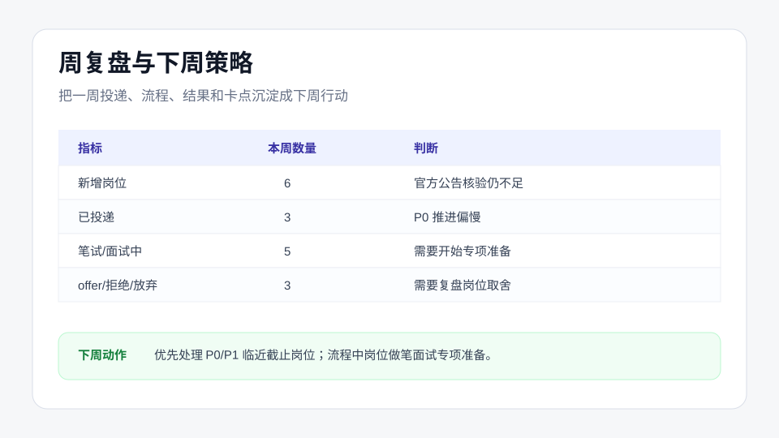
</p>

### 11. Offer 决策

适用场景：你拿到意向、体检、签约通知，或同时有多个银行机会需要取舍。

怎么用：

```text
我拿到南京银行总分行管培、上海农商银行运营支持和浦发上海分行的机会。
帮我做 Offer 决策，但先列出必须核验的问题。
```

产物：合同主体、岗位真相、薪酬拆解、KPI、轮岗、违约金、三方约束核验清单和决策建议。

### 12. 邮件提醒草稿

适用场景：你希望把提醒同步成邮件，但仍想先确认内容。

怎么用：

```text
根据今天的提醒摘要，生成一封邮件提醒草稿。先不要发送，只给我确认版本。
```

产物：邮件草稿、建议回写状态、下一步确认项。默认不发送真实邮件。

<p>
  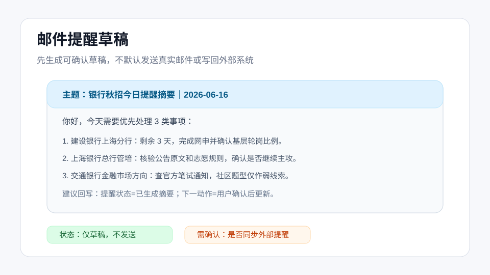
</p>

## 完整工作流

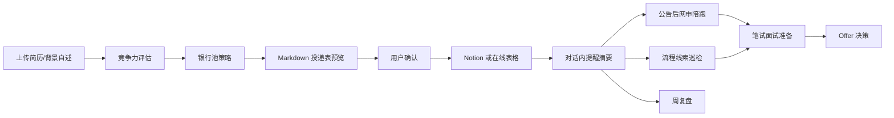

完整案例素材已经覆盖：

- 用户简历素材。
- 简历竞争力评估产物。
- 银行池策略产物。
- Notion 工作台样例行。
- 公告/JD 素材。
- 对话内提醒摘要样例。
- 笔面试准备素材。
- Offer 决策素材。

素材入口：[full-workflow-case.md](.agents/skills/bank-autumn-recruitment/assets/full-workflow-case.md)

## 快速开始

### 1. 克隆仓库

```bash
git clone https://github.com/wljsxmmxmm/bank-autumn-recruitment-skill.git
cd bank-autumn-recruitment-skill
```

### 2. 在支持 Agent Skills 的环境中使用

把 Skill 目录放到你的 Agent 可读取的 Skills 目录中，或直接在当前仓库中打开支持 Agent Skills 的工具。

核心目录：

```text
.agents/skills/bank-autumn-recruitment
```

如果你想复制到本机全局 Skills 目录，可以按你的工具选择目标目录，例如：

```bash
cp -r .agents/skills/bank-autumn-recruitment ~/.codex/skills/
```

或：

```bash
cp -r .agents/skills/bank-autumn-recruitment ~/.claude/skills/
```

### 3. 用自然语言触发

可以直接对 Codex、Claude Code 或其他支持 Skills 的 Agent 说：

```text
我是 2027 届，想投银行秋招，先帮我做一个从简历到 Offer 的陪跑计划。
```

或：

```text
我上传了简历，帮我评估银行秋招竞争力，并生成投递梯队和追踪表预览。
```

## 常用启动语

```text
我是 2027 届，想投银行秋招，先带我做规划。
```

```text
我上传了简历，帮我评估银行秋招竞争力，并生成投递梯队和追踪表预览。
```

```text
把这些银行岗位生成 Markdown 追踪表，确认后再放到我的 Notion 里。
```

```text
读取我的 Notion 投递表，生成今天的截止提醒、网申陪跑、流程线索和周复盘摘要。
```

```text
这个银行公告出来了，帮我选岗位、改简历和准备网申。
```

```text
我拿到两个银行 Offer，帮我用不可能三角做决策。
```

## 开源许可

本项目采用 [MIT License](LICENSE)。你可以自由使用、修改和分发，但需要保留原始版权和许可说明。
